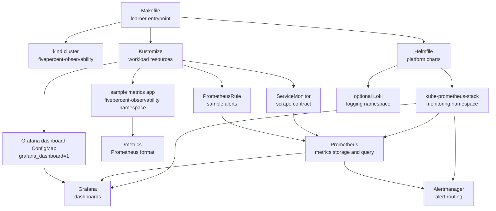
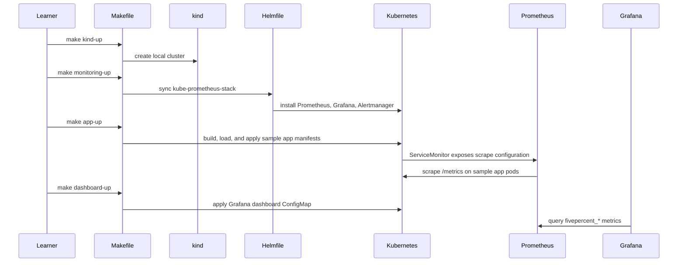

# Observability Lab Architecture

## Purpose
This document explains the local architecture for the 5percent observability lab.
The lab keeps platform setup, application workload, dashboards, and optional appendices separated so each teaching phase can be run independently.

## Component Topology

## Runtime Flow

## Boundary Rules
- `Makefile` owns local commands and hides repeated flags from learners.
- `infrastructure/kubernetes/helmfile.yaml` owns Helm chart releases.
- `infrastructure/kubernetes/apps/` owns workload manifests.
- `infrastructure/kubernetes/dashboards/` owns Grafana dashboard provisioning.
- `infrastructure/kubernetes/alerts/` owns Prometheus alert rules.
- `app/` owns the sample HTTP service and its metrics.

## Chart Compatibility
The monitoring stack pins `kube-prometheus-stack` chart `87.10.1`, which was the latest public chart release found in the Prometheus Community chart metadata on 2026-07-08.
The optional logging appendix pins Grafana Loki chart `6.55.0` from `https://grafana.github.io/helm-charts`.
The public Loki migration documentation identifies this as the final Grafana-repo Loki chart family before the community-chart migration path.

## Resource Model
The lab uses memory limits and CPU requests only.
This keeps the manifests compatible with the workspace Kubernetes rule that forbids CPU limits.
