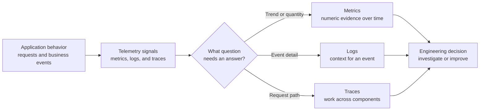
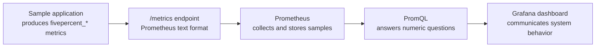

# 01: Observability Fundamentals

## Purpose
This topic explains what observability is, which signals support it, and how the local lab turns application behavior into evidence.

## Prerequisites
- You can describe the purpose of a web service.
- You know that a running service can behave differently from its source code or design.
- You have read the [learning path overview](README.md).

## Learning Objectives
By the end of this topic, you should be able to:
- Define observability without naming a specific tool.
- Distinguish metrics, logs, and traces by the questions they answer.
- Explain why the lab starts with metrics.
- Follow the high-level path from the sample application to a dashboard.

## Core Explanation
Observability is the ability to understand a running system from the signals it produces.
It helps an engineer move from a question such as "Why is the service slow?" to evidence about traffic, errors, latency, and resource pressure.
Monitoring is the practice of watching known conditions, while observability also supports questions that were not predicted when the system was built.

Metrics are numeric measurements sampled over time.
They are efficient for aggregation, comparison, dashboards, and alert conditions.
Logs are timestamped event records that provide detailed context about a particular action or failure.
Traces connect work across components so an engineer can follow one request through a distributed system.
No single signal answers every question, so a useful observability design gives each signal a clear role.

This lab is metrics-first because its main questions are numeric.
It asks how many requests arrive, how long requests take, how many business events occur, and whether Prometheus can reach its targets.
The logging and alerting topics remain useful extensions, but they do not replace the metrics path.

Observability also depends on system architecture.
The application owns metric instrumentation, Kubernetes owns the local runtime and network resources, Prometheus owns collection and querying, and Grafana owns visualization.
Clear ownership makes failures easier to locate because each boundary has a specific contract.

## Example From This Lab
The sample application exposes Prometheus-format metrics at `/metrics`.
The metric `fivepercent_http_requests_total` records handled requests and separates series with `method`, `endpoint`, and `status` labels.
The histogram `fivepercent_http_request_duration_seconds` records request-duration observations with `method` and `endpoint` labels.
The gauge `fivepercent_http_requests_in_progress` represents current concurrent work.
The counter `fivepercent_business_events_total` records synthetic events with an `event_type` label.
Prometheus collects these metrics, and Grafana visualizes queries that describe request rate, p95 latency, business events, and scrape target health.

## Common Mistakes
- Treating observability as a product purchase instead of a capability built from useful signals and clear questions.
- Collecting data without deciding which engineering question it should answer.
- Assuming that a healthy process means users receive correct and timely responses.
- Using metrics for detailed event reconstruction when a log or trace would provide better evidence.
- Adding every possible label or signal without considering cost, clarity, and maintenance.

## Demo Checkpoint
Continue with [Checkpoint 1: Understand the Running System](../runbooks/core-observability-lab.md#checkpoint-1-understand-the-running-system).

## Knowledge Check
1. How is observability broader than watching a fixed health check?
2. Which signal would you use first to compare request latency over thirty minutes, and why?
3. Which signal would you use to inspect the exact context of one application error?
4. What are the ownership boundaries between the sample application, Kubernetes, Prometheus, and Grafana?
5. Why is a metrics-first approach appropriate for this lab?

## Related Reading
- [Learning Path Overview](README.md)
- [Observability Lab Architecture](../architecture.md)
- [Kubernetes Primer](02-kubernetes-primer.md)
- [Metrics Data Model](03-metrics-data-model.md)
- [Optional Logging Appendix](../appendices/logging-with-loki.md)
