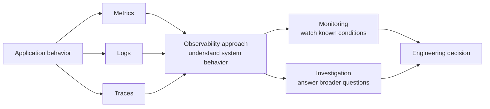
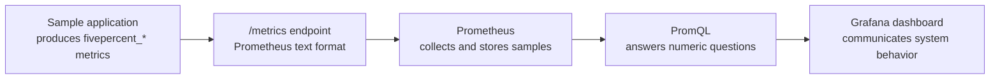

# 01: Observability Fundamentals

## Purpose

This topic explains what observability is, how monitoring fits within a broader observability approach, which signals support both, and how the local lab turns application behavior into evidence.

## Prerequisites

- You can describe the purpose of a web service.

- You know that a running service can behave differently from its source code or design.

- You have read the [learning path overview](README.md).

## Learning Objectives

By the end of this topic, you should be able to:

- Define observability without naming a specific tool.

- Distinguish observability from monitoring while explaining how the two relate.

- Distinguish metrics, logs, and traces and explain how they can support monitoring and broader observability.

- Follow the high-level path from the sample application to a dashboard.

## Core Explanation

Observability is the broad capability to understand a system's internal behavior from the signals it produces.

It supports detecting known problems, investigating unexpected behavior, and understanding the causes behind what users and operators observe.

For example, when a service becomes slow, observability helps an engineer move from the symptom to evidence about traffic, errors, latency, resource pressure, and dependencies.

### Observability and Monitoring

Monitoring is the practice of watching known conditions with predefined checks, dashboards, and alerts.

In this learning path, monitoring is treated as one operational practice within a broader observability approach.

This is an operational framing for the learning path rather than a strict universal taxonomy.

| Area | Observability | Monitoring |
| --- | --- | --- |
| Scope | Broad understanding of system behavior | Known conditions selected in advance |
| Questions | Known and unexpected questions | Predefined questions and thresholds |
| Primary goal | Explain behavior and causes | Detect and track expected conditions |
| Typical outputs | Investigation findings, causal explanations, and engineering decisions | Checks, dashboards, alerts, and status views |
| Example | Identify which dependency caused rising latency | Alert when latency exceeds a threshold |

Monitoring can detect that service latency crossed a predefined threshold and show when the condition began.

Observability work can then use available signals to determine whether the cause is traffic growth, resource pressure, an application error, or a failing dependency.

### Telemetry Signals

Metrics are numeric measurements sampled over time.

They are efficient for aggregation, comparison, dashboards, and alert conditions.

Logs are timestamped event records that provide detailed context about a particular action or failure.

Traces connect work across components so an engineer can follow one request through a distributed system.

Metrics, logs, and traces are not exclusively monitoring signals or observability signals because their role depends on how they are used.

A metric threshold alert is monitoring.

A log threshold alert is also monitoring.

Examining related logs to investigate an unexpected failure is observability work.

Correlating metrics, logs, and traces to identify a failing dependency is also observability work.

No single signal answers every question, so a useful observability design gives each signal a clear role.

Observability also depends on system architecture.

The application owns metric instrumentation, Kubernetes owns the local runtime and network resources, Prometheus owns collection and querying, and Grafana owns visualization.

Clear ownership makes failures easier to locate because each boundary has a specific contract.

## Example From This Lab

The sample application exposes Prometheus-format metrics at `/metrics`.

The metric `fivepercent_http_requests_total` records handled requests and separates series with `method`, `endpoint`, and `status` labels.

The histogram `fivepercent_http_request_duration_seconds` records request-duration observations with `method` and `endpoint` labels.

The gauge `fivepercent_http_requests_in_progress` represents current concurrent work.

The counter `fivepercent_business_events_total` records synthetic events with an `event_type` label.

Prometheus collects these metrics, and Grafana visualizes queries that describe request rate, p95 latency, business events, and scrape target health.

## Common Mistakes

- Treating observability as a product purchase instead of a capability built from useful signals and clear questions.

- Collecting data without deciding which engineering question it should answer.

- Assuming that a healthy process means users receive correct and timely responses.

- Using metrics for detailed event reconstruction when a log or trace would provide better evidence.

- Assuming metrics belong to monitoring while logs and traces belong to observability, even though all three can support both depending on their use.

- Adding every possible label or signal without considering cost, clarity, and maintenance.

## Demo Checkpoint

Continue with [Checkpoint 1: Understand the Running System](../runbooks/core-observability-lab.md#checkpoint-1-understand-the-running-system).

## Knowledge Check

1. How is observability broader than monitoring?

2. Which signal would you use first to compare request latency over thirty minutes, and why?

3. Which signal would you use to inspect the exact context of one application error?

4. What are the ownership boundaries between the sample application, Kubernetes, Prometheus, and Grafana?

5. Are logs part of monitoring or observability, and what is one example of each use?

## Related Reading

- [Learning Path Overview](README.md)

- [Observability Lab Architecture](../architecture.md)

- [Kubernetes Primer](02-kubernetes-primer.md)

- [Metrics Data Model](03-metrics-data-model.md)

- [Optional Logging Appendix](../appendices/logging-with-loki.md)
