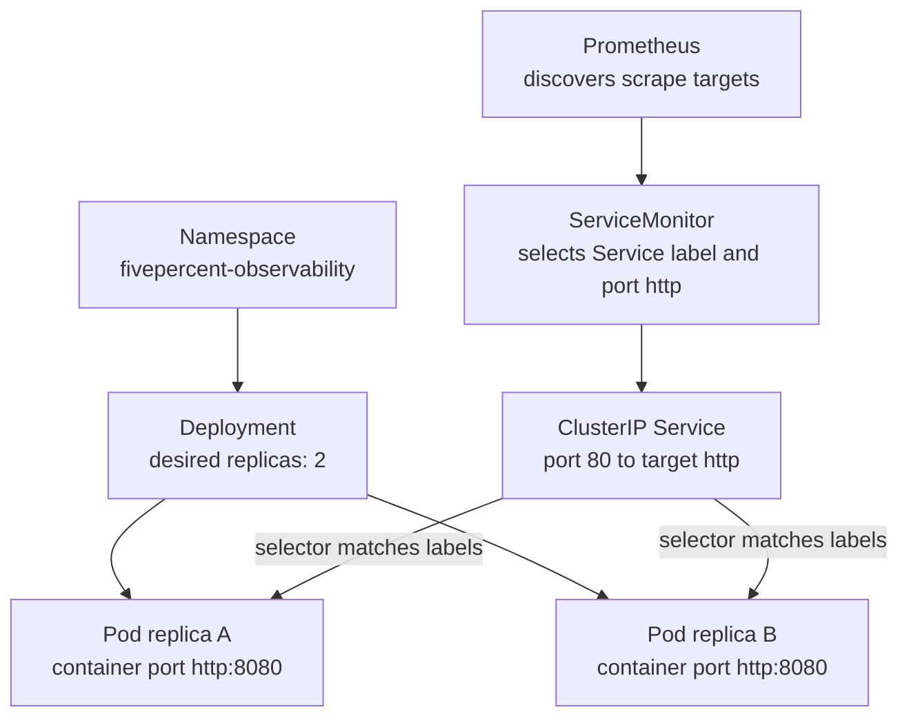
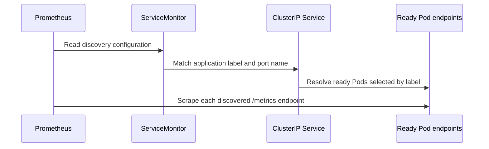

# 02: Kubernetes Primer

## Purpose
This topic introduces the Kubernetes resources that run the sample application and expose it to Prometheus inside the local `kind` cluster.

## Prerequisites
- You understand that a container packages an application and its runtime dependencies.
- You have read [Observability Fundamentals](01-observability-fundamentals.md).
- You do not need prior experience operating Kubernetes.

## Learning Objectives
By the end of this topic, you should be able to:
- Explain the roles of a Namespace, Deployment, Pod, Service, and ServiceMonitor.
- Describe how labels and selectors connect Kubernetes resources.
- Follow traffic from a ClusterIP Service to either application replica.
- Explain why the Service port name is part of the Prometheus scrape contract.

## Core Explanation
A Kubernetes Namespace groups related resources and gives commands and policies a clear scope.
A Deployment declares how many application replicas should run and manages the Pods that contain those replicas.
A Pod is the smallest deployable Kubernetes unit and provides the network identity used by the application container.
A Service gives a changing set of Pods a stable virtual address and port.
A ClusterIP Service is reachable inside the cluster and is suitable for communication between Prometheus and the sample application.

Kubernetes connects resources through labels and selectors.
The Deployment places the label `app.kubernetes.io/name: sample-metrics-app` on each Pod.
The Service selects Pods with that label and builds an endpoint set from ready matching Pods.
The ServiceMonitor selects the Service with the same application label.
This chain is declarative because each resource states what it should match instead of storing a fixed Pod address.

Port names are also part of the contract.
The application container listens on port `8080` and names that container port `http`.
The Service exposes port `80` and sends traffic to the named target port `http`, which resolves to container port `8080`.
The ServiceMonitor refers to the Service port by the same name, so `http` must remain consistent across the resources.

The ServiceMonitor is a custom resource provided by the Prometheus Operator.
It does not scrape metrics itself.
It describes how the operator-managed Prometheus instance should discover and scrape matching Services.

## Example From This Lab
All application resources live in the `fivepercent-observability` namespace.
The `sample-metrics-app` Deployment requests two replicas, so Kubernetes works to keep two application Pods available.
Each application container listens on the named `http` port at `8080`.
The `sample-metrics-app` ClusterIP Service exposes port `80` and forwards to the named `http` target port.
The `sample-metrics-app` ServiceMonitor selects the Service and tells Prometheus to use its named `http` port.
Readiness and liveness probes call `/healthz`, while Prometheus uses `/metrics`, so runtime health and telemetry collection have separate paths.

## Common Mistakes
- Treating a Deployment as the running process when the actual containers run inside Pods.
- Assuming a Service creates Pods instead of selecting Pods that already exist.
- Using inconsistent labels so the Service or ServiceMonitor selects no resource.
- Confusing Service port `80` with the application's container port `8080`.
- Renaming the Service port without updating the ServiceMonitor endpoint.
- Assuming two desired replicas always means two ready scrape targets during startup or a rollout.

## Demo Checkpoint
Continue with [Checkpoint 2: Inspect Kubernetes Resources](../runbooks/core-observability-lab.md#checkpoint-2-inspect-kubernetes-resources).

## Knowledge Check
1. Which resource maintains the desired count of two application replicas?
2. Why can a Service keep a stable identity when Pods are replaced?
3. How does traffic on Service port `80` reach container port `8080`?
4. Which two matching mechanisms let the ServiceMonitor reach the application Pods?
5. Why might Prometheus temporarily show fewer than two healthy targets?

## Related Reading
- [Observability Fundamentals](01-observability-fundamentals.md)
- [Observability Lab Architecture](../architecture.md)
- [Prometheus And Scraping](04-prometheus-and-scraping.md)
- [Core Observability Lab Runbook](../runbooks/core-observability-lab.md)
