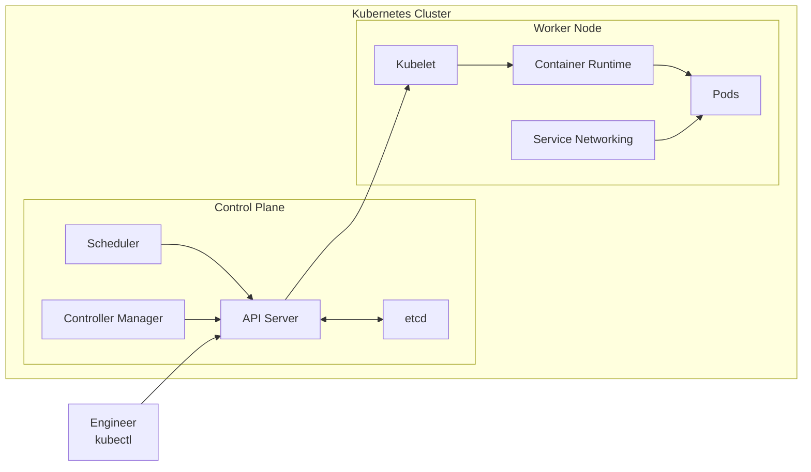
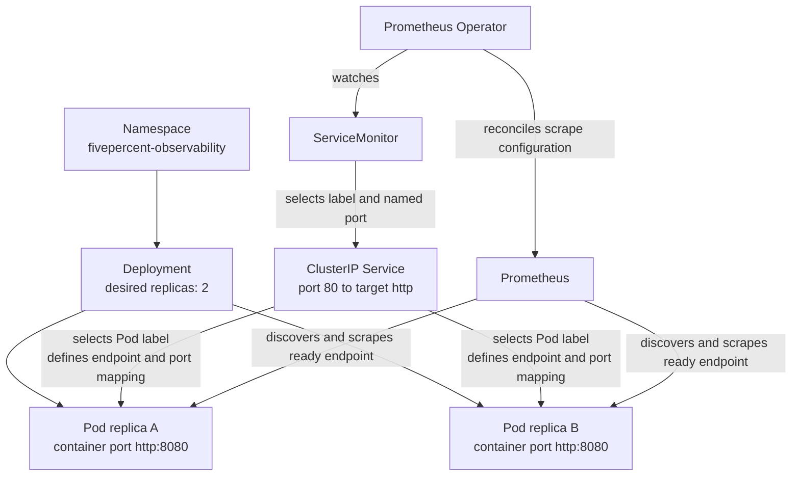
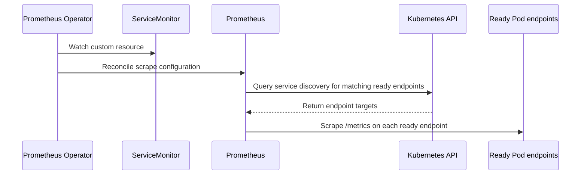

# 02: Kubernetes Primer

## Purpose

This topic introduces Kubernetes architecture first, then the resources that run the sample application and expose it to Prometheus inside the local `kind` cluster.

## Prerequisites

- You understand that a container packages an application and its runtime dependencies.
- You have read [Observability Fundamentals](01-observability-fundamentals.md).
- You do not need prior experience operating Kubernetes.

## Learning Objectives

By the end of this topic, you should be able to:

- Identify the roles of the control plane and worker nodes.
- Explain the roles of core Kubernetes architecture components at a beginner level.
- Distinguish Kubernetes architecture components from Kubernetes API resources.
- Explain the roles of a Namespace, Deployment, Pod, Service, and ServiceMonitor.
- Explain how the Prometheus Operator uses a ServiceMonitor to configure discovery before Prometheus discovers and scrapes application Pod endpoints.

## Core Explanation

A Kubernetes cluster has a control plane and one or more worker nodes.

The control plane receives the desired state and coordinates the cluster.

Worker nodes run Pods that contain application containers.

The API Server is the central API and coordination point for the cluster.

Production clusters often separate control-plane and worker roles across machines, while a local `kind` cluster may combine roles on fewer machines.

### Kubernetes Architecture

| Component | Where it runs | What it is used for |
| --- | --- | --- |
| API Server | Control plane | It receives commands and exposes the Kubernetes API. |
| etcd | Control plane | It stores the desired and current cluster state. |
| Scheduler | Control plane | It selects a node for a new Pod. |
| Controller Manager | Control plane | It reconciles actual state with desired state. |
| Kubelet | Worker node | It ensures assigned Pods and containers run. |
| Container Runtime | Worker node | It starts and stops containers. |
| Service Networking | Worker nodes | It routes Service traffic to suitable Pods. |

### Kubernetes Resources

Control-plane and node components operate Kubernetes itself.
Resources such as Deployments, Pods, and Services describe what users want Kubernetes to run.

| Resource | What it is used for |
| --- | --- |
| Namespace | It groups related resources and gives them a scope. |
| Deployment | It declares and maintains a desired number of application replicas. |
| Pod | It runs one or more closely related containers and is the smallest deployable Kubernetes unit. |
| Service | It gives a changing set of Pods a stable address and port. |
| ServiceMonitor | It tells the Prometheus Operator how Prometheus should discover matching Services and scrape their endpoint targets, and it is a custom resource rather than a built-in Kubernetes resource. |

### How This Lab Connects Resources

A ClusterIP Service is reachable inside the cluster, but this lab's Prometheus discovery resolves ready endpoints and scrapes those endpoints directly.

Kubernetes connects resources through labels and selectors.

The Deployment places the label `app.kubernetes.io/name: sample-metrics-app` on each Pod.

The Service selects Pods with that label and builds an endpoint set from ready matching Pods.

The ServiceMonitor selects the Service with the same application label.

This chain is declarative because each resource states what it should match instead of storing a fixed Pod address.

Port names are also part of the contract.

The application container listens on port `8080` and names that container port `http`.

The Service exposes port `80` and sends traffic to the named target port `http`, which resolves to container port `8080`.

The ServiceMonitor refers to the Service port by the same name, so `http` must remain consistent across the resources.

The ServiceMonitor is a custom resource provided by the Prometheus Operator.

It does not scrape metrics itself.

The Prometheus Operator watches ServiceMonitor custom resources.

The Operator reconciles their discovery and scrape intent into Prometheus scrape configuration.

Prometheus uses Kubernetes service discovery to obtain matching ready endpoints.

Prometheus scrapes `/metrics` directly from each endpoint target.

## Example From This Lab

All application resources live in the `fivepercent-observability` namespace.

The `sample-metrics-app` Deployment requests two replicas, so Kubernetes works to keep two application Pods available.

Each application container listens on the named `http` port at `8080`.

The `sample-metrics-app` ClusterIP Service exposes port `80` and forwards to the named `http` target port.

The `sample-metrics-app` ServiceMonitor selects the Service and defines discovery and scrape intent for its named `http` port.

The Prometheus Operator reconciles that intent into Prometheus scrape configuration.

Readiness and liveness probes call `/healthz`, while Prometheus uses `/metrics`, so runtime health and telemetry collection have separate paths.

## Common Mistakes

- Confusing control-plane or node components with API resources such as Deployments and Services.
- Assuming ServiceMonitor is built into Kubernetes instead of being a custom resource provided by the Prometheus Operator.
- Assuming Prometheus reads a ServiceMonitor directly instead of using configuration reconciled by the Prometheus Operator.
- Treating a Deployment as the running process when the actual containers run inside Pods.
- Assuming a Service creates Pods instead of selecting Pods that already exist.
- Using inconsistent labels so the Service or ServiceMonitor selects no resource.
- Confusing Service port `80` with the application's container port `8080`.
- Renaming the Service port without updating the ServiceMonitor endpoint.
- Assuming two desired replicas always means two ready scrape targets during startup or a rollout.

## Demo Checkpoint

Continue with [Checkpoint 2: Inspect Kubernetes Resources](../runbooks/core-observability-lab.md#checkpoint-2-inspect-kubernetes-resources).

## Knowledge Check

1. What does the control plane do, and what runs on a worker node?
2. How is an architecture component such as the API Server different from an API resource such as a Deployment?
3. Which resource maintains the desired count of two application replicas?
4. Why can a Service keep a stable identity when Pods are replaced?
5. How does a ServiceMonitor become Prometheus configuration that discovers and scrapes matching ready Pod endpoints?
6. Why might Prometheus temporarily show fewer than two healthy targets?

## Related Reading

- [Observability Fundamentals](01-observability-fundamentals.md)
- [Observability Lab Architecture](../architecture.md)
- [Prometheus And Scraping](04-prometheus-and-scraping.md)
- [Core Observability Lab Runbook](../runbooks/core-observability-lab.md)
