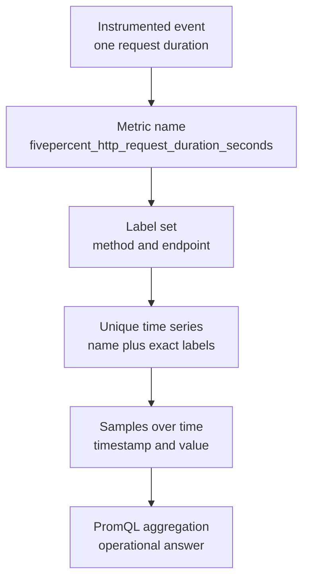
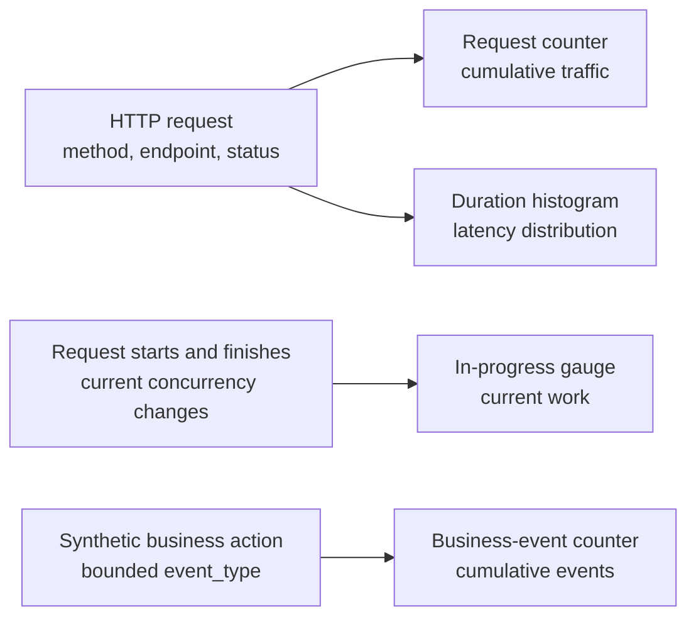

# 03: Metrics Data Model

## Purpose
This topic explains how Prometheus represents measurements as metric names, labels, samples, and time series.

## Prerequisites
- You have read [Observability Fundamentals](01-observability-fundamentals.md).
- You understand the Kubernetes resources described in [Kubernetes Primer](02-kubernetes-primer.md).
- You can distinguish a total from a current value.

## Learning Objectives
By the end of this topic, you should be able to:
- Define a metric sample and a time series.
- Explain how labels create separate time series.
- Choose between a counter, gauge, and histogram for a basic measurement.
- Identify the application-defined labels on each lab metric.
- Explain why unbounded label values create a reliability and cost risk.

## Core Explanation
A Prometheus sample contains a metric name, a set of labels, a numeric value, and a timestamp assigned during collection.
A time series is the ordered stream of samples with one exact metric name and one exact label set.
Changing any label value creates a different time series even when the metric name stays the same.
Labels make aggregation flexible, but every additional label combination consumes storage and query resources.

A counter represents a cumulative total that normally increases.
A process restart can reset a counter to zero, so engineers usually query its rate or increase over a time window instead of subtracting raw values manually.
A gauge represents a current value that can increase or decrease.
A histogram counts observations in cumulative buckets and also exposes a total observation count and sum.
Histograms support distribution questions such as p95 latency without storing every individual observation.

Prometheus histograms expand one instrument into related series.
The `_bucket` series use an `le` label to identify an upper bucket boundary.
The `_count` series record the number of observations.
The `_sum` series record the sum of observed values.
Quantile calculations rely on the cumulative bucket series and must preserve the `le` label during aggregation.

Good labels describe bounded dimensions that engineers need to filter or group.
Values such as HTTP method, a stable route name, response status, or a small event category are usually bounded.
Values such as user IDs, request IDs, raw URLs, timestamps, and arbitrary error messages are usually unbounded.
An unbounded label can create a rapidly growing number of series, which is called high cardinality.



## Example From This Lab
`fivepercent_http_requests_total` is a counter with `method`, `endpoint`, and `status` labels.
It supports request traffic and error questions while keeping route and status dimensions available for grouping.
`fivepercent_http_request_duration_seconds` is a histogram with `method` and `endpoint` labels.
It produces bucket, count, and sum series that support latency distribution queries.
`fivepercent_http_requests_in_progress` is a gauge without application-defined labels.
Prometheus still attaches discovery labels such as target and job identity when it stores scraped samples.
`fivepercent_business_events_total` is a counter with an `event_type` label whose current values come from a small synthetic set.



The following illustrative series identities show how one changed label creates a new series.

```text
fivepercent_http_requests_total{method="GET",endpoint="work",status="200"}
fivepercent_http_requests_total{method="GET",endpoint="work",status="500"}
```

## Common Mistakes
- Reading a raw counter as activity per second without applying a time-window function.
- Using a counter for a value that must decrease, such as requests currently in progress.
- Treating histogram buckets as independent ranges even though Prometheus buckets are cumulative.
- Removing the `le` label before calling `histogram_quantile()`.
- Adding user IDs, request IDs, or unrestricted URLs as labels.
- Assuming application-defined labels are the only labels stored by Prometheus.

## Demo Checkpoint
Continue with [Checkpoint 3: Inspect Application Metrics](../runbooks/core-observability-lab.md#checkpoint-3-inspect-application-metrics).

## Knowledge Check
1. What exact change creates a new Prometheus time series?
2. Why should a request counter be queried over a time window?
3. Which metric type represents requests that are active right now?
4. Which generated histogram series are needed for a p95 calculation?
5. Why is a request ID a dangerous label value?
6. Which labels belong to `fivepercent_http_requests_total` in this lab?

## Related Reading
- [Prometheus And Scraping](04-prometheus-and-scraping.md)
- [PromQL Basics](05-promql-basics.md)
- [Sample Application README](../../app/README.md)
- [Observability Lab Architecture](../architecture.md)
