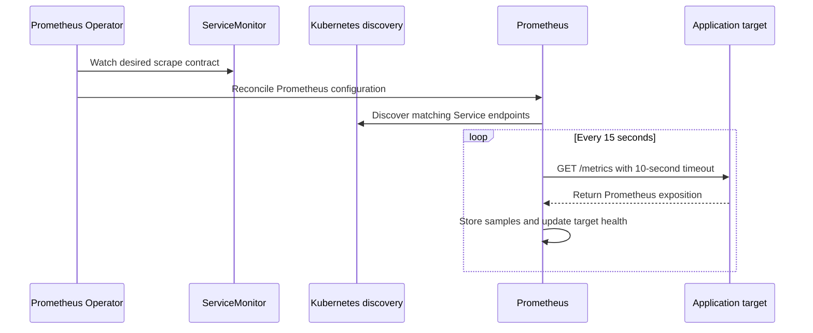
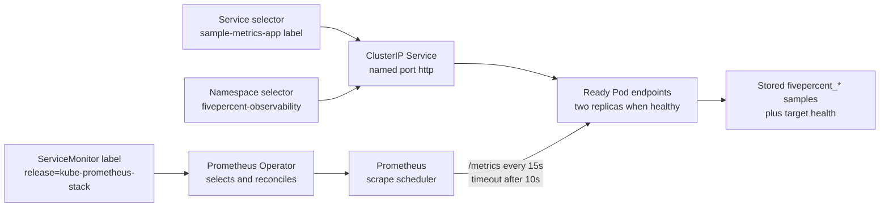

# 04: Prometheus And Scraping

## Purpose

This topic explains how Prometheus discovers the sample application, pulls metrics from `/metrics`, and stores the resulting samples.

## Prerequisites

- You have read [Kubernetes Primer](02-kubernetes-primer.md).

- You understand metric names, labels, and time series from [Metrics Data Model](03-metrics-data-model.md).

- You know that the sample application runs only in the local `kind` cluster.

## Learning Objectives

By the end of this topic, you should be able to:

- Explain the Prometheus pull model.

- Describe how the ServiceMonitor discovery chain reaches application endpoints.

- Interpret the scrape interval and timeout.

- Explain what the generated `up` metric says and does not say.

- Locate common scrape failures by checking one contract at a time.

## Core Explanation

Prometheus usually collects metrics with a pull model.

At each configured interval, Prometheus sends an HTTP request to every discovered target and parses the returned exposition format.

If a scrape succeeds, Prometheus stores the metric samples with the scrape timestamp and target labels.

If the request fails, times out, or returns invalid data, Prometheus records the target as unhealthy.

Prometheus needs discovery configuration because Pod addresses can change.

The Prometheus Operator watches ServiceMonitor resources and translates them into Prometheus scrape configuration.

A ServiceMonitor selects a Kubernetes Service by label, selects namespaces to search, and names the Service port and HTTP path to use.

Kubernetes service discovery then resolves the ready endpoints behind the selected Service.

The scrape interval controls how often Prometheus starts a scrape.

The scrape timeout limits how long Prometheus waits for one scrape to finish.

The timeout should be shorter than the interval so a slow scrape does not consume the entire collection cycle.

Short intervals give fresher data but create more requests, samples, storage use, and query work.

Prometheus creates an `up` series for each scrape target.

An `up` value of `1` means the most recent scrape succeeded.

An `up` value of `0` means Prometheus discovered the target but could not complete the most recent scrape.

No matching `up` series can mean that discovery failed before a target was created, so absence is different from a failed scrape.

Target health proves telemetry reachability, not correct application behavior for users.

## Example From This Lab

The `sample-metrics-app` ServiceMonitor lives in the `fivepercent-observability` namespace.

Its `release: kube-prometheus-stack` label allows the lab's operator-managed Prometheus selection rules to include it.

Its selector matches the `app.kubernetes.io/name: sample-metrics-app` label on the Service.

Its namespace selector restricts discovery to `fivepercent-observability`.

Its endpoint uses the named Service port `http`, requests `/metrics`, scrapes every `15s`, and uses a `10s` timeout.

The Service selects ready Pods from the two-replica Deployment, so a stable rollout normally provides two application scrape targets.

## Common Mistakes

- Assuming Prometheus finds every Service automatically without a matching discovery configuration.

- Forgetting the `release=kube-prometheus-stack` label required by this lab's ServiceMonitor selection.

- Matching the wrong Service label or searching the wrong namespace.

- Referring to a Service port name that does not exist.

- Using a scrape timeout equal to or longer than the scrape interval.

- Treating `up == 1` as proof that every application feature is correct.

- Treating an absent target as the same state as a discovered target with `up == 0`.

## Demo Checkpoint

Continue with [Checkpoint 4: Verify Prometheus Scraping](../runbooks/core-observability-lab.md#checkpoint-4-verify-prometheus-scraping).

## Knowledge Check

1. Which component converts a ServiceMonitor into Prometheus configuration?

2. Which resource connects the ServiceMonitor selector to the ready Pods?

3. What do the `15s` interval and `10s` timeout control?

4. What is the difference between `up == 0` and no matching `up` series?

5. Why can the sum of healthy targets temporarily be lower than two?

6. Which four ServiceMonitor fields or labels would you inspect first when discovery fails?

## Related Reading

- [Kubernetes Primer](02-kubernetes-primer.md)

- [Metrics Data Model](03-metrics-data-model.md)

- [PromQL Basics](05-promql-basics.md)

- [Observability Lab Architecture](../architecture.md)

- [Core Observability Lab Runbook](../runbooks/core-observability-lab.md)
