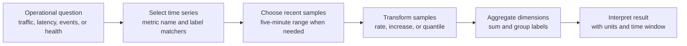
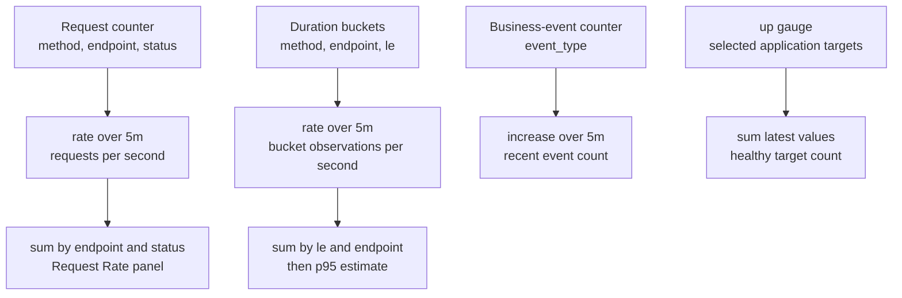

# 05: PromQL Basics

## Purpose

This topic explains how the lab's PromQL queries transform stored time series into operational answers.

## Prerequisites

- You understand counters, gauges, histograms, labels, and time series from [Metrics Data Model](03-metrics-data-model.md).

- You understand how Prometheus collects samples from [Prometheus And Scraping](04-prometheus-and-scraping.md).

- You do not need previous query-language experience.

## Learning Objectives

By the end of this topic, you should be able to:

- Read a PromQL expression from the inside out.

- Use label matchers to select relevant series.

- Explain when to use `rate()`, `increase()`, `sum`, and `histogram_quantile()`.

- Explain the four queries used by the existing Grafana dashboard.

- Preserve the labels required for useful grouping and histogram quantiles.

## Core Explanation

PromQL works with sets of time series called vectors.

A metric selector chooses series by metric name and optional label matchers.

A range selector such as `[5m]` gives a function the samples from the previous five minutes.

A function transforms those samples, and an aggregation combines or groups the resulting series.

Read a nested query from the inside out.

First identify the selected metric and time range.

Then identify the transformation, such as calculating a counter rate.

Finally identify the aggregation and the labels preserved in the result.

This order makes a complex expression easier to connect to an engineering question.

`rate()` estimates the average per-second increase of a counter over a time window and handles normal counter resets.

`increase()` estimates how much a counter increased over a time window.

`sum` combines values, while `sum by (...)` combines values but preserves the named grouping labels.

`histogram_quantile()` estimates a quantile from cumulative histogram buckets.

The bucket aggregation must preserve `le` because that label defines each bucket boundary.

A five-minute window smooths short changes and gives `rate()` several scrape samples in this lab.

It also means the result describes recent history rather than an instantaneous event.

The right window depends on the operational question, scrape interval, traffic volume, and desired responsiveness.



## Example From This Lab

The Request Rate panel calculates per-second request activity and keeps the endpoint and status dimensions.

```promql
sum by (endpoint, status) (rate(fivepercent_http_requests_total[5m]))
```

The inner `rate()` converts each request counter series into an average requests-per-second value over five minutes.

The outer aggregation combines other dimensions, such as separate scrape targets, while preserving `endpoint` and `status`.

The p95 Latency panel estimates the duration below which about 95 percent of observed requests fall for each endpoint.

```promql
histogram_quantile(0.95, sum by (le, endpoint) (rate(fivepercent_http_request_duration_seconds_bucket[5m])))
```

The inner `rate()` calculates per-second bucket growth.

The `sum by (le, endpoint)` combines targets while preserving bucket boundaries and endpoint groups.

The outer function estimates p95 from those cumulative buckets.

The result is an estimate shaped by the configured bucket boundaries, not the slowest request and not an average.

The Synthetic Business Events panel estimates the number of events added during the last five minutes and keeps each event type separate.

```promql
sum by (event_type) (increase(fivepercent_business_events_total[5m]))
```

The Scrape Targets Up panel counts the latest successful application scrapes.

```promql
sum(up{namespace="fivepercent-observability", service="sample-metrics-app"})
```

With two discovered and healthy application targets, the sum is normally `2`.

A lower value means fewer successful latest scrapes, while no returned result can indicate that no series matched the selector.



## Common Mistakes

- Applying `rate()` to a gauge instead of a counter.

- Comparing raw counter values across process restarts.

- Reading a five-minute rate as an instantaneous value.

- Dropping `le` before applying `histogram_quantile()`.

- Calling p95 an average or assuming it identifies the single slowest request.

- Aggregating away `status` before checking whether errors contribute to traffic.

- Forgetting that an empty result can mean the selector matched no series.

- Assuming a target-health sum of `2` proves that application responses are correct.

## Demo Checkpoint

Continue with [Checkpoint 5: Query Metrics With PromQL](../runbooks/core-observability-lab.md#checkpoint-5-query-metrics-with-promql).

## Knowledge Check

1. In what order should you read a nested PromQL query?

2. What unit does `rate(fivepercent_http_requests_total[5m])` produce?

3. Why does the request-rate query preserve both `endpoint` and `status`?

4. Why must the p95 query preserve the `le` label?

5. How does `increase()` answer a different question from `rate()`?

6. What are two different explanations for a target-health result below `2`?

## Related Reading

- [Metrics Data Model](03-metrics-data-model.md)

- [Prometheus And Scraping](04-prometheus-and-scraping.md)

- [Golden Signals](06-golden-signals.md)

- [Grafana Dashboard Design](07-grafana-dashboard-design.md)

- [Observability Lab Validation](../validation.md)

- [Core Observability Lab Runbook](../runbooks/core-observability-lab.md)
