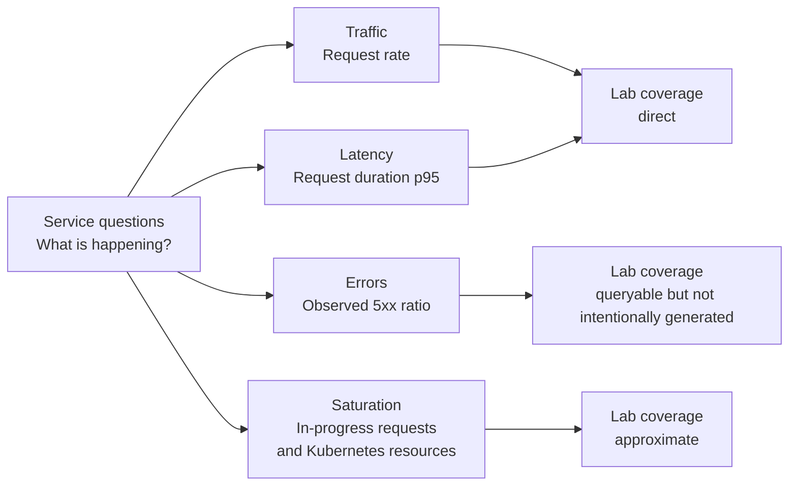

# 06: Golden Signals

## Purpose
This chapter introduces the four golden signals and maps them to the signals that the local sample application actually exposes.

## Prerequisites
- Understand that Prometheus stores numeric time series.
- Recognize counters, gauges, and histograms.
- Know that the lab runs only on a local `kind` cluster.

## Learning Objectives
By the end of this chapter, you should be able to:
- Define traffic, errors, latency, and saturation.
- Match each golden signal to a useful application or Kubernetes metric.
- Explain which golden signals the current lab represents well and which it only approximates.
- Identify instrumentation gaps without claiming that missing behavior already exists.

## Core Explanation
The golden signals are four categories that help engineers ask balanced questions about a service.

### Traffic
Traffic describes how much work reaches the service.
For an HTTP service, request rate is a common traffic signal.
The lab derives request rate from `fivepercent_http_requests_total`, grouped by endpoint and status.

### Errors
Errors describe the portion of work that does not complete successfully.
The request counter includes a `status` label, so Prometheus can query observed `5xx` responses.
The sample application has an exception handler, but it has no endpoint that intentionally produces errors.
Normal lab traffic may therefore show no error series, and learners should not manufacture a claim that errors were tested.

### Latency
Latency describes how long work takes.
The lab records request durations in the `fivepercent_http_request_duration_seconds` histogram.
The dashboard estimates p95 latency, which helps answer how slow the slower end of observed requests is.
An aggregate percentile is useful for trends, but it does not explain one individual request.

### Saturation
Saturation describes how close a constrained resource is to its useful capacity.
The application exposes `fivepercent_http_requests_in_progress`, which indicates current concurrency.
The monitoring stack also collects Kubernetes resource data that can provide CPU and memory context.
These signals only approximate saturation because the lab does not define a tested capacity limit or a queue-depth metric.



The four signals should be read together.
Traffic gives context to latency and errors, while saturation can help explain why either signal worsens.
A quiet service with no errors is different from a busy service with no errors, and an `up` target is not proof that user requests are fast or correct.

## Example From This Lab
The dashboard gives direct views of traffic and latency through the **Request Rate** and **p95 Latency** panels.
The request counter makes error-rate queries possible because it records HTTP status codes, but the dashboard does not currently include an error-rate panel.
The application gauge and Kubernetes resource metrics can support a saturation discussion, but neither establishes the service's actual capacity.
The **Synthetic Business Events** panel adds product-oriented context, while **Scrape Targets Up** reports whether Prometheus can scrape the application.

A small illustrative error-ratio expression is:

```promql
sum(rate(fivepercent_http_requests_total{status=~"5.."}[5m]))
/
clamp_min(sum(rate(fivepercent_http_requests_total[5m])), 0.001)
```

This expression describes observed errors only.
It does not prove that the lab intentionally generated an error.

## Common Mistakes
- Treating scrape success as proof that the service is healthy for users.
- Calling every infrastructure metric a saturation signal without defining the constrained resource.
- Reading p95 latency as the duration of a specific request.
- Assuming an empty error graph means the error path was tested.
- Looking at one golden signal without checking traffic context.
- Adding metrics because they are available rather than because they answer an operational question.

## Demo Checkpoint
Use [Checkpoint 6: Map the golden signals](../runbooks/core-observability-lab.md#checkpoint-6-map-the-golden-signals) to connect these concepts to the running local lab.

## Knowledge Check
1. Which metric supports the traffic signal in this lab?
2. Why can errors be queried even though the application has no intentional error endpoint?
3. Why is the in-progress request gauge only an approximation of saturation?
4. Which dashboard panel would you inspect first for a report of slow requests?
5. What extra signal would help you understand whether the application is approaching a real capacity limit?

## Related Reading
- [PromQL Basics](05-promql-basics.md)
- [Grafana Dashboard Design](07-grafana-dashboard-design.md)
- [SLI and SLO Basics](08-sli-and-slo-basics.md)
- [Sample application metrics](../../app/README.md)
- [Observability lab architecture](../architecture.md)
