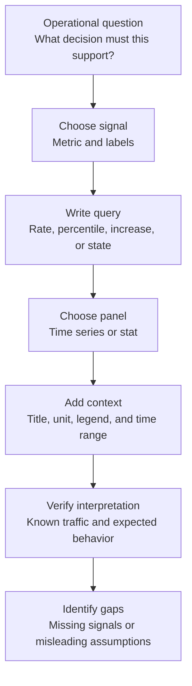
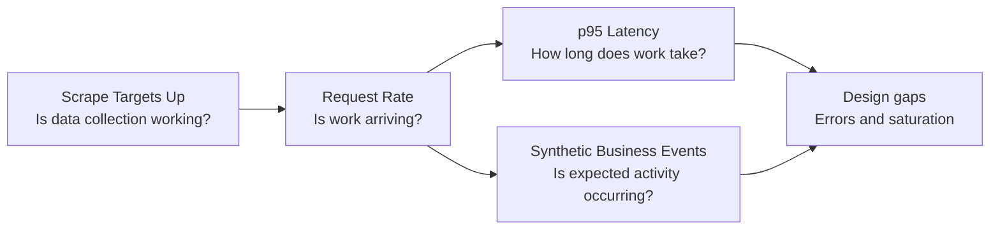

# 07: Grafana Dashboard Design

## Purpose

This chapter explains how to design and read a small Grafana dashboard that answers operational questions instead of merely displaying available data.

## Prerequisites

- Understand the golden signals.

- Know that Grafana visualizes queries and does not collect application metrics itself.

- Be familiar with the sample application's counter and histogram metrics.

## Learning Objectives

By the end of this chapter, you should be able to:

- Start dashboard design from user and operator questions.

- Choose a panel type that fits the signal.

- Read the four panels in the lab without overstating what they prove.

- Identify missing context and instrumentation.

## Core Explanation

A useful dashboard is a structured set of questions.

Each panel should have a clear audience, a decision it supports, and enough context to avoid misleading conclusions.

### Start With Questions

Begin with questions such as:

- Is the service receiving traffic?

- Are requests becoming slower?

- Are expected business events occurring?

- Can Prometheus scrape the service?

Only add a panel when its query helps answer one of these questions.

A compact dashboard with clear intent is easier to use than a large dashboard of unrelated charts.

### Match The View To The Signal

Time-series panels are useful for rates, latency trends, and event changes because time is part of the question.

Stat panels are useful for a current state such as the number of healthy scrape targets.

Units, legends, and time ranges should make the result readable without requiring the learner to inspect the underlying JSON.

### Read In Context

Dashboard values depend on the selected time range, query window, current traffic, and available labels.

A panel with no data can mean no traffic, a query mismatch, a scrape problem, or an instrument that has not produced that label set yet.

The correct response is to check context before treating an empty panel as a service failure.

### Separate Service Health From Monitoring Health

A successful scrape proves that Prometheus reached a metrics endpoint at that moment.

It does not prove that user-facing behavior is correct, fast, or available through every path.

Monitoring-health panels are valuable, but they should be labeled and interpreted separately from user-experience panels.

## Example From This Lab

The `5percent Sample Metrics App` dashboard contains exactly four panels:

1. **Request Rate** shows requests per second grouped by endpoint and status over a five-minute rate window.

2. **p95 Latency** estimates the 95th percentile request duration by endpoint from histogram buckets.

3. **Synthetic Business Events** shows event increases by event type over five minutes.

4. **Scrape Targets Up** shows the current sum of healthy Prometheus scrape targets for the application service.

The first two panels represent traffic and latency directly.

The business-events panel demonstrates how technical activity can be related to a sanitized product-oriented signal.

The scrape-target panel reports observability pipeline health, not complete application health.

The dashboard does not include a dedicated error-rate panel or a direct saturation panel.

When reading the dashboard, move from collection health to workload context:

## Common Mistakes

- Building panels from available metrics before defining the question.

- Treating `up` as a complete service-health indicator.

- Using a percentile without stating its unit, grouping, or time window.

- Showing counters as raw totals when the question is about current activity.

- Using vague panel titles such as `Requests` or `Health`.

- Assuming no data always means zero.

- Adding too many label dimensions and creating a dashboard that is hard to read.

- Presenting synthetic business events as real business outcomes.

## Demo Checkpoint

Use [Checkpoint 7: Read the Grafana dashboard](../runbooks/core-observability-lab.md#checkpoint-7-read-the-grafana-dashboard) to practice interpreting all four panels.

## Knowledge Check

1. Why is request rate better represented as a time series than a single raw counter value?

2. What does **Scrape Targets Up** prove, and what does it not prove?

3. Which two golden signals have direct panels in the current dashboard?

4. What are two plausible explanations for an empty panel?

5. Which new panel would you add first for a service where failed requests matter?

## Related Reading

- [Golden Signals](06-golden-signals.md)

- [SLI and SLO Basics](08-sli-and-slo-basics.md)

- [Alerting Fundamentals](09-alerting-fundamentals.md)

- [Dashboard definition](../../infrastructure/kubernetes/dashboards/sample-app-dashboard.yaml)
