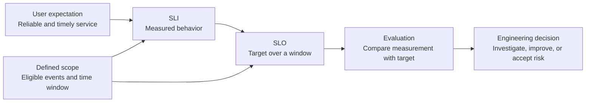

# 08: SLI and SLO Basics

## Purpose

This chapter introduces service-level indicators and service-level objectives as a way to connect measured service behavior to an explicit reliability target.

## Prerequisites

- Understand traffic, errors, and latency as service signals.

- Know that Prometheus queries can calculate rates and ratios over time.

- Be able to distinguish a measurement from a goal.

## Learning Objectives

By the end of this chapter, you should be able to:

- Define an SLI and an SLO.

- Propose a conceptual availability or latency SLI for the sample application.

- Explain why the measurement population and time window matter.

- State clearly that this lab does not configure SLO enforcement.

## Core Explanation

An SLI is a measured indicator of service behavior.

An SLO is a target for that indicator over a defined period.

The SLI answers what was measured, while the SLO answers what level the service aims to achieve.

An availability-style SLI can be expressed conceptually as:

```text
successful eligible requests / all eligible requests
```

A latency-style SLI can be expressed conceptually as:

```text
eligible requests completed below a chosen duration / all eligible requests
```

The word `eligible` is important.

A useful definition states which endpoints, status codes, request types, and time periods count.

Without those boundaries, two engineers can calculate different results from the same service.



### Choose Indicators That Reflect User Experience

Scrape availability is useful for checking the monitoring path, but it is not the same as request success from a user's perspective.

An HTTP success ratio or latency threshold is usually closer to user experience for this sample service.

The selected SLI should be measurable from current instrumentation or should identify a specific instrumentation gap.

### Define The Objective Precisely

A conceptual objective needs a target, a time window, and an indicator definition.

For example, a team might propose that a chosen proportion of eligible requests complete successfully over a chosen rolling period.

The exact numbers should reflect user needs and service constraints rather than being copied from another system.

### Keep This Lab Conceptual

The lab exposes enough metrics to discuss candidate SLIs and SLOs.

It does not install an SLO controller, define an error-budget policy, create SLO recording rules, or enforce an SLO.

Any target used during the exercise is a learning proposal, not a configured reliability commitment.

## Example From This Lab

The status label on `fivepercent_http_requests_total` can support a conceptual request-success SLI.

The request-duration histogram can support a conceptual latency SLI based on the proportion of requests below a selected threshold.

The dashboard's p95 latency panel is useful context, but a percentile chart alone is not a complete SLO definition.

A learner could propose the following conceptual design:

- **SLI:** The proportion of eligible application requests that return a non-`5xx` response.

- **SLO:** A chosen target proportion over a chosen rolling window.

- **Scope decision:** Decide whether health checks and the metrics endpoint belong in the eligible request set.

- **Current status:** Proposed for discussion only and not enforced by this repository.

This exercise is about making each decision explicit.

It is not evidence that the target is currently achieved.

## Common Mistakes

- Calling a target an SLI instead of an SLO.

- Defining a target without a time window.

- Using scrape success as a substitute for user-visible request success.

- Including health checks and metrics scrapes without deciding whether they represent user activity.

- Copying a high target from another service without considering user needs.

- Claiming an SLO is implemented because a relevant metric exists.

- Using p95 latency without defining which requests and period it covers.

## Demo Checkpoint

Use [Checkpoint 8: Derive a conceptual SLI and SLO](../runbooks/core-observability-lab.md#checkpoint-8-derive-a-conceptual-sli-and-slo) to propose and critique an SLI/SLO pair.

## Knowledge Check

1. What is the difference between an SLI and an SLO?

2. Why must an SLO include a time window?

3. Which application metric could support a request-success SLI?

4. Why is **Scrape Targets Up** not enough for a user-facing availability SLI?

5. Is any SLO enforced by this lab?

## Related Reading

- [Golden Signals](06-golden-signals.md)

- [Grafana Dashboard Design](07-grafana-dashboard-design.md)

- [Alerting Fundamentals](09-alerting-fundamentals.md)

- [Sample application metrics](../../app/README.md)
