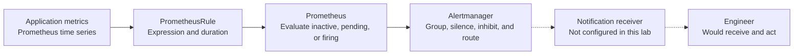
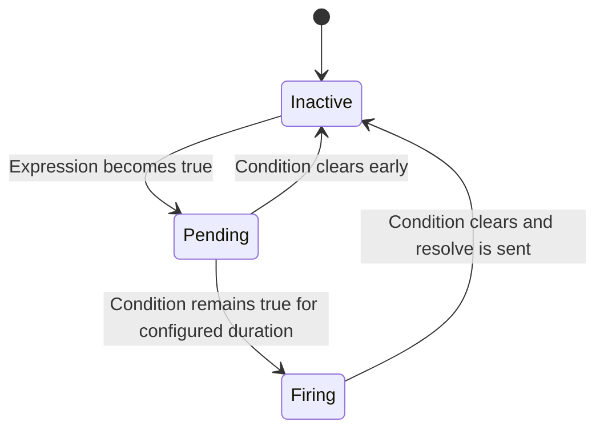

# 09: Alerting Fundamentals

## Purpose
This chapter explains how metric conditions become actionable alerts and how Prometheus and Alertmanager divide responsibility in the local lab.

## Prerequisites
- Understand Prometheus metrics and queries.
- Know the difference between service behavior and scrape health.
- Be familiar with the idea of a threshold evaluated over time.

## Learning Objectives
By the end of this chapter, you should be able to:
- Explain the roles of `PrometheusRule`, Prometheus, and Alertmanager.
- Read the expression, duration, labels, and annotations of a basic alert.
- Describe the two alert rules included in the lab.
- Explain why the lab does not send real notifications.
- Recognize common causes of noisy or unactionable alerts.

## Core Explanation
An alert is a condition that requires attention, not merely an interesting graph value.
Prometheus evaluates alert expressions against collected time series.
The `for` field requires a condition to remain true for a duration before the alert fires.
Labels classify the alert, while annotations provide human-readable context.

Alertmanager receives firing alerts from Prometheus.
It handles grouping, silencing, inhibition, and routing toward notification receivers.
This separation lets Prometheus focus on evaluation while Alertmanager focuses on alert delivery policy.

### Alert State
An alert is inactive when its expression is false.
It becomes pending when the expression is true but the `for` duration has not elapsed.
It becomes firing when the condition remains true for the full duration.
It returns to inactive after the expression becomes false.

### Actionability
An actionable alert identifies a meaningful symptom, provides useful context, and points toward a response.
An alert should not fire merely because a value changed.
Thresholds and durations should reflect the impact and expected normal variation of the service.

### Notification Boundary
The local stack includes Alertmanager for routing demonstrations.
No real email, chat, paging, or webhook receiver is configured.
Seeing a firing alert in Prometheus or Alertmanager proves rule evaluation and routing into Alertmanager, but it does not prove external notification delivery.

## Example From This Lab
The lab includes two warning-level rules.

### FivePercentSampleAppDown
`FivePercentSampleAppDown` checks whether the sum of healthy scrape targets is below `1` or whether the target series is absent.
The condition must remain true for `1m` before firing.
The explicit `absent(...)` branch matters because a missing series is not always equivalent to the numeric value zero.

### FivePercentSampleAppHighErrorRate
`FivePercentSampleAppHighErrorRate` calculates the ratio of observed `5xx` request rate to total request rate over five-minute query windows.
It fires when that ratio is greater than `5%` for `2m`.
The application has no endpoint that intentionally returns errors, so normal demo traffic may not trigger this rule.

The down alert is suitable for a reversible local demonstration because the application can be made unavailable and then restored through the runbook.
The goal is to inspect state transitions and rule meaning, not to simulate a production incident.

## Common Mistakes
- Alerting on every visible metric.
- Choosing a threshold without understanding normal behavior.
- Omitting a duration and firing on brief noise.
- Assuming a missing series is always the same as zero.
- Treating scrape health as complete user-facing availability.
- Writing annotations that do not explain impact or likely next steps.
- Assuming Alertmanager automatically sends notifications without a configured receiver.
- Testing the high-error rule when the application has no intentional error endpoint.

## Demo Checkpoint
Use [Checkpoint: Inspect and trigger an alert](../runbooks/optional-alerting-lab.md#checkpoint-inspect-and-trigger-an-alert) to inspect the rules and perform the reversible local alert exercise.

## Knowledge Check
1. Which component evaluates the alert expression?
2. What does the `for` duration protect against?
3. When does `FivePercentSampleAppDown` fire?
4. What ratio and duration does `FivePercentSampleAppHighErrorRate` use?
5. Why does this lab not prove that an external notification was delivered?

## Related Reading
- [SLI and SLO Basics](08-sli-and-slo-basics.md)
- [Designing an Observability System](11-designing-an-observability-system.md)
- [Alerting with Alertmanager appendix](../appendices/alerting-with-alertmanager.md)
- [Sample alert rules](../../infrastructure/kubernetes/alerts/sample-app-alerts.yaml)
