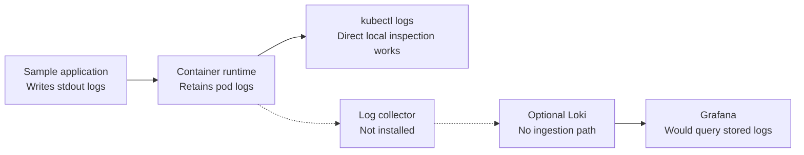
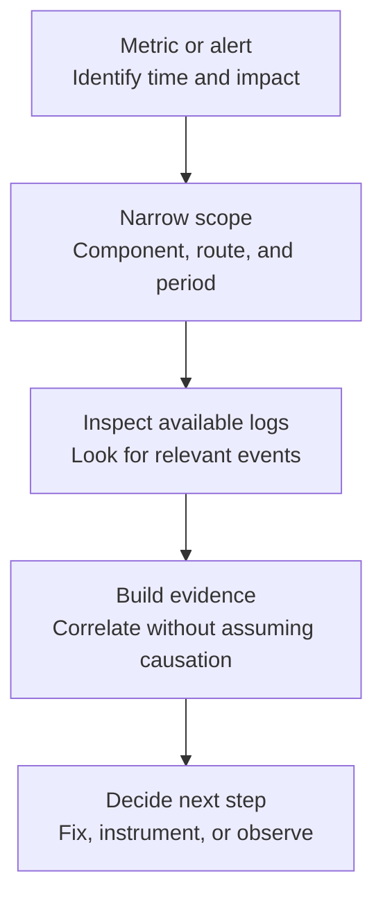

# 10: Logging Fundamentals

## Purpose

This chapter explains how logs complement metrics and states the exact logging boundary of the local lab.

> **Important:** The application writes logs that `kubectl logs` can read, and the optional exercise can install Loki, but the repository has no log collector and no complete Loki ingestion path.

## Prerequisites

- Understand that metrics summarize numeric behavior over time.

- Know that the sample application runs in Kubernetes on local `kind`.

- Be familiar with the difference between producing, collecting, storing, and querying telemetry.

## Learning Objectives

By the end of this chapter, you should be able to:

- Explain what logs are useful for.

- Describe how logs complement metrics during an investigation.

- Identify the difference between direct pod-log access and centralized logging.

- Explain why installing Loki alone does not make application logs queryable in Loki.

- Propose safe, structured fields without exposing sensitive data.

## Core Explanation

Logs are timestamped event records produced by an application or platform component.

They help engineers investigate specific events after a metric or alert identifies a symptom.

Metrics are efficient for trends and aggregation, while logs provide event-level context.

### The Logging Path

A complete centralized logging path needs several stages.

The application must emit logs, a collector must read them, a transport must send them, a backend must store and index them, and a query tool must retrieve them.

Removing any required stage breaks the end-to-end path.



In this lab, the solid path ends at direct inspection with `kubectl logs`.

The dashed path marks missing functionality rather than a working pipeline.

Installing Loki provides a backend, but no collector sends container logs to it.

### Useful Log Content

A useful application log records enough context to understand an event without exposing secrets or personal data.

Common safe fields include a timestamp, severity, component, route template, status category, and sanitized request identifier.

Logs should avoid credentials, tokens, raw request bodies, and unnecessary personal information.

A tiny illustrative structured event might look like:

```json
{"level":"info","event":"request_completed","route":"/work","status":200}
```

This snippet illustrates fields only.

The current sample application uses standard Python and Flask log output rather than this exact JSON format.

### Logs During Investigation

A practical investigation often starts with a broad metric symptom, narrows the affected time and component, and then inspects logs for event details.

Logs do not replace metrics because searching all events is inefficient for many trend questions.

Metrics do not replace logs because an aggregate cannot explain every failure.



## Example From This Lab

The Flask application writes request and runtime output to standard output.

Kubernetes makes that output available through `kubectl logs`, so direct local inspection works.

The optional logging lab installs Loki in single-binary mode with local filesystem storage settings.

It does not install Promtail, Grafana Alloy, or another collector.

It also does not configure a complete Grafana-to-Loki application-log query path.

Learners should treat Loki as an installed backend boundary and a follow-up design topic, not as a completed logging solution.

## Common Mistakes

- Assuming that installing Loki automatically collects Kubernetes logs.

- Claiming an end-to-end logging pipeline works after validating only the Loki pod.

- Logging secrets, tokens, request bodies, or personal data.

- Using unbounded free-form messages when stable fields would make investigation easier.

- Treating logs as the only monitoring signal.

- Assuming temporal correlation proves that one event caused another.

- Forgetting that direct pod logs may be harder to use after pod replacement or across many replicas.

## Demo Checkpoint

Use [Checkpoint: Inspect logs and Loki boundaries](../runbooks/optional-logging-lab.md#checkpoint-inspect-logs-and-loki-boundaries) to verify direct logs and identify the intentionally missing ingestion stages.

## Knowledge Check

1. Which part of the logging path works end to end in the current lab?

2. Why does a running Loki instance not prove that application logs are stored there?

3. Which missing component would read container logs and send them to Loki?

4. What information should never be placed in logs?

5. When would you move from a metric to logs during an investigation?

## Related Reading

- [Designing an Observability System](11-designing-an-observability-system.md)

- [Logging with Loki appendix](../appendices/logging-with-loki.md)

- [Observability lab architecture](../architecture.md)

- [Sample application](../../app/README.md)
