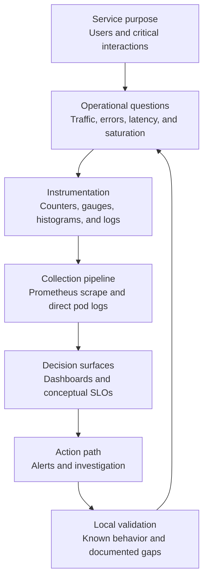
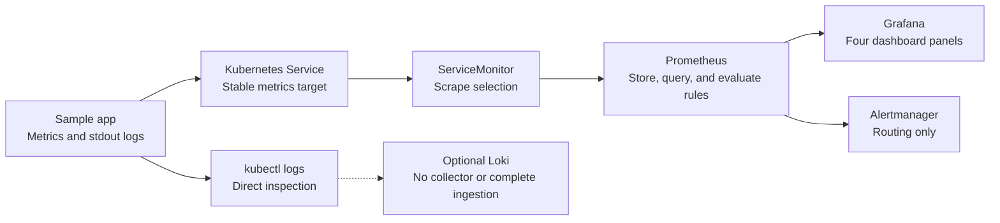

# 11: Designing an Observability System

## Purpose
This chapter combines metrics, dashboards, conceptual SLOs, alerts, and logs into a repeatable design process for a small service.

## Prerequisites
- Understand the golden signals.
- Be able to interpret the lab's four Grafana panels.
- Know the difference between an SLI and an SLO.
- Understand the roles of Prometheus, Alertmanager, and logs.

## Learning Objectives
By the end of this chapter, you should be able to:
- Start an observability design from service purpose and user expectations.
- Select a small set of useful metrics and labels.
- Connect metrics to dashboard panels, conceptual SLOs, and alerts.
- State collection and investigation boundaries accurately.
- Produce a basic observability design for a sanitized example service.

## Core Explanation
Observability design begins with the service and its users, not with a list of tools.
The goal is to make important service behavior measurable and to support clear engineering decisions.

### Step 1: Define The Service Boundary
State what the service does, who depends on it, and which interactions matter.
Use a generic description when discussing a workplace service, and do not include internal names, endpoints, customer data, credentials, or architecture details.

### Step 2: Ask Operational Questions
Write a small set of questions before selecting metrics.
Useful questions cover incoming work, failed work, latency, capacity pressure, expected business events, and telemetry collection health.

### Step 3: Choose Signals And Instrumentation
Choose the smallest set of counters, gauges, and histograms that answer the questions.
Use bounded labels such as route templates or status categories.
Avoid labels containing user identifiers, request identifiers, raw URLs, or other high-cardinality values.

### Step 4: Define Collection And Storage
Describe how each signal reaches its backend.
For this lab, Prometheus scrapes application metrics through a `ServiceMonitor`.
Application logs are available directly through Kubernetes, while centralized Loki ingestion remains incomplete because no collector is installed.

### Step 5: Design Views And Objectives
Create dashboard panels that answer the original questions.
Propose one conceptual SLI and SLO with an explicit scope and window.
Do not claim enforcement unless the system actually evaluates and applies the objective.

### Step 6: Add Actionable Alerts
Alert on symptoms that require a response.
Define the threshold, duration, severity, human context, and expected action.
Document whether a real notification receiver exists.

### Step 7: Validate And Improve
Generate known local behavior, verify each signal stage, and compare the result with the intended question.
Record gaps as future instrumentation work instead of hiding them with broad claims.

An observability system is a feedback loop.
Instrumentation produces evidence, dashboards organize it, objectives describe desired behavior, alerts identify urgent conditions, and logs support investigation.
Every stage should have an owner, a validation method, and a known boundary.

## Example From This Lab
The sample application exposes request, duration, in-progress, and synthetic business-event metrics.
Prometheus discovers the service through a `ServiceMonitor`, stores the metrics, and evaluates optional alert rules.
Grafana displays **Request Rate**, **p95 Latency**, **Synthetic Business Events**, and **Scrape Targets Up**.
Alertmanager handles alert grouping and routing, but no real notification receiver is configured.
Direct application logs are available with `kubectl logs`.
Optional Loki can be installed, but there is no collector and no complete Loki ingestion path.
SLI and SLO work remains a conceptual design exercise with no configured enforcement.

### Design Worksheet
For a new service, capture:
- A generic service purpose and its important user interaction.
- Three to five metrics with type, labels, and operational question.
- A mapping from each metric to a golden signal or service-specific outcome.
- Three dashboard panels with a clear audience and decision.
- One conceptual SLI and SLO with scope and time window.
- One or two alerts with threshold, duration, impact, and response.
- The logs needed for investigation and the fields that must be excluded.
- The complete collection path and any intentionally missing stages.
- A local or sandbox validation approach.

### Homework Options
Choose one of these two options.

#### Option 1: Form-Submission Metric In This Repository
Implement a form-submission metric in this repository using a generic form and sanitized event names.
Define what counts as a submission, select a metric type, choose bounded labels, propose a dashboard panel, and describe one useful alert or conceptual SLI.
Keep all work local to the lab and do not include real user data.

#### Option 2: A Useful Workplace Metric
Identify a useful metric in a service you encounter at work and design how you would observe it.
Use only generic, sanitized descriptions such as `example-api`, `submission`, or `background-job`.
Do not share internal service names, domains, repository details, customer information, credentials, or private architecture.
The exercise needs the reasoning and signal design, not internal details.

For either option, explain the operational question first and then connect the metric to a dashboard, conceptual SLI/SLO, alert, and investigation log.

## Common Mistakes
- Starting with tools instead of service and user questions.
- Collecting every available metric without a decision it supports.
- Using labels with unbounded or sensitive values.
- Treating scrape health as complete service health.
- Designing alerts that have no owner or expected action.
- Claiming a conceptual SLO is enforced.
- Claiming Loki contains logs when no collector sends them.
- Requesting internal workplace details when a sanitized example is sufficient.
- Ignoring validation and rollback for a local exercise.

## Demo Checkpoint
Use [Checkpoint 9: Design a basic observability system](../runbooks/core-observability-lab.md#checkpoint-9-design-a-basic-observability-system) to complete the design worksheet against the local sample service.

## Knowledge Check
1. Why should observability design begin with service questions rather than tools?
2. Which labels are likely to create high-cardinality or privacy problems?
3. What does the current lab provide for metrics, alerts, and logs?
4. Which parts of the lab remain conceptual or incomplete?
5. What information should be removed when using a workplace example?
6. How would you validate that a proposed metric answers its original operational question?

## Related Reading
- [Golden Signals](06-golden-signals.md)
- [Grafana Dashboard Design](07-grafana-dashboard-design.md)
- [SLI and SLO Basics](08-sli-and-slo-basics.md)
- [Alerting Fundamentals](09-alerting-fundamentals.md)
- [Logging Fundamentals](10-logging-fundamentals.md)
- [Observability lab architecture](../architecture.md)
