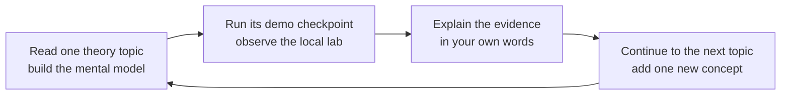

# Observability Fundamentals Learning Path

## Purpose

This learning path builds a beginner-friendly mental model for observing a service in the local `kind` lab.

It connects software behavior, Kubernetes resources, Prometheus metrics, PromQL, Grafana, reliability thinking, alerting, and logging.

## How To Use This Path

Work through the topics in order because each topic introduces vocabulary used by the next one.

Read the theory in a topic file before following its linked demo checkpoint.

The theory explains why the system behaves as it does, while the runbook owns commands, expected terminal output, troubleshooting, and cleanup.

Topics 01 through 08 form the main metrics-first path.

Topics 09 and 10 are optional extensions for alerting and logging.

Topic 11 is a design exercise that combines the full path without requiring a new runtime component.

## Ordered Path

1. [Observability Fundamentals](01-observability-fundamentals.md) introduces observability, telemetry signals, and the lab's system boundaries.

2. [Kubernetes Primer](02-kubernetes-primer.md) explains how the namespace, Deployment, Pods, Service, and ServiceMonitor fit together.

3. [Metrics Data Model](03-metrics-data-model.md) explains metric names, samples, labels, time series, counters, gauges, and histograms.

4. [Prometheus And Scraping](04-prometheus-and-scraping.md) follows the pull path from service discovery to stored samples.

5. [PromQL Basics](05-promql-basics.md) turns stored samples into request rate, p95 latency, business-event counts, and target health.

6. [Golden Signals](06-golden-signals.md) uses traffic, errors, latency, and saturation to evaluate coverage.

7. [Grafana Dashboard Design](07-grafana-dashboard-design.md) maps PromQL results to the four panels in the lab dashboard.

8. [SLI And SLO Basics](08-sli-and-slo-basics.md) connects measured indicators to explicit reliability objectives.

9. [Alerting Fundamentals](09-alerting-fundamentals.md) is an optional topic about actionable conditions, routing, and alert fatigue.

10. [Logging Fundamentals](10-logging-fundamentals.md) is an optional topic about using event detail to investigate a metric symptom.

11. [Designing An Observability System](11-designing-an-observability-system.md) applies the learning path to a service design exercise.

## Learning Flow

## Local Lab Boundary

All practical work targets the local `kind-fivepercent-observability` context.

The application runs in the `fivepercent-observability` namespace, and the monitoring stack runs in the `monitoring` namespace.

The learning path does not require remote clusters, cloud services, production access, or secrets.

## Expected Learning Outcome

After the main path, you should be able to explain how application behavior becomes a metric, how Prometheus discovers and scrapes that metric, and how a PromQL query answers an operational question.

You should also be able to read the lab dashboard, identify missing coverage with the golden signals, and propose a basic SLI and SLO.

After the optional topics and final exercise, you should be able to sketch a small observability system with useful metrics, dashboard panels, actionable alerts, and investigation logs.

## Validation

Each topic includes a knowledge check and a link to one runbook checkpoint.

Complete a topic when you can answer its knowledge check and explain the checkpoint evidence without relying only on tool names.
